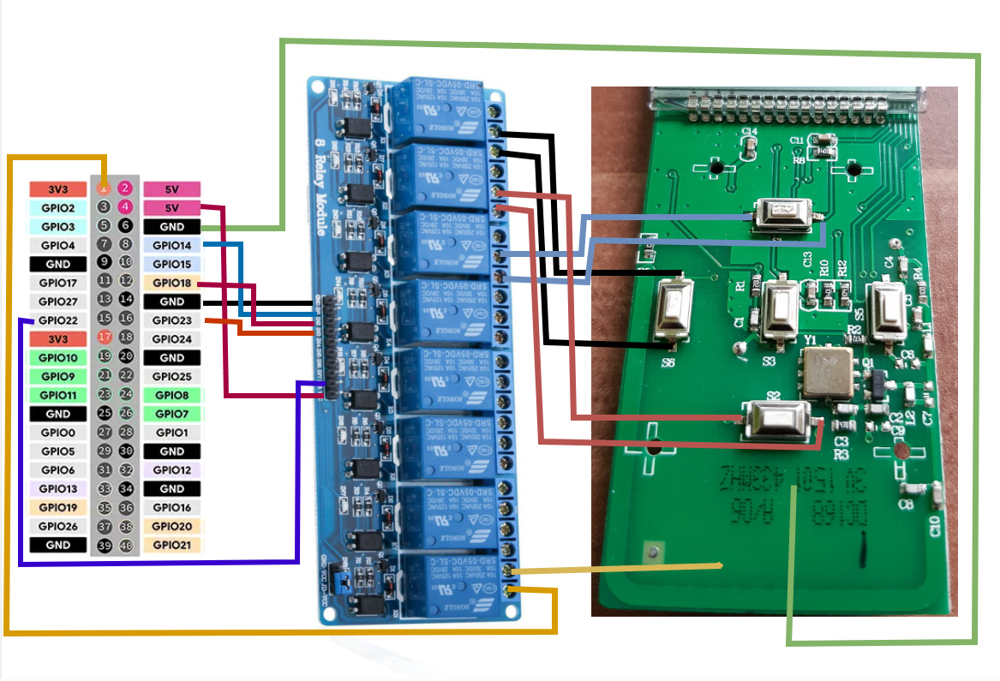

<h1 align="center">Yooda Remote</h1>
  <h2 align="center">Wiring</h2>

 
 

# Info
This is my Setup to Use my Yooda Shutter Remote with Home Assistant at home. There is a Network Remote official from Yooda which is much more expensive tho. 

I Used a 8 Port Relay but you don't have to you can also use a 4 Port Relay. You could expand the Project if you can Solder better than me you also can add the "Stop" and the "Right" Button and use them with Relay 24 and 4. But be carefull when Soldering the "Right" Button because you can harm the Remote very easily!

## You need:
1- A Raspberry Pi 3,4,5 or Zero

2- A Relay Module 4/8 

3- Some Jumper Cables

4- Know How to Solder the Remote Wires

5- SSH Access to your Raspberry Pi

*6 - Optional : SSH Command for Home Assistant -> https://github.com/AlexxIT/SSHCommand 

## Run it with

`python ./yooda-remote.py [remote Nr 0-15] [open|close]`
